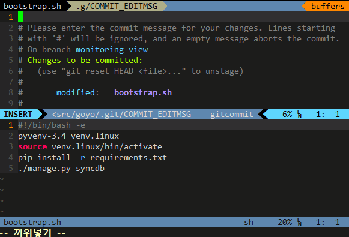

# vim-jira-complete

`jira-complete` is a Vim plugin that queries JIRA issues and make a AutoComplete list for you.

This will be helpful if you are using Jira with DVCS smart commits and [Fugitive.vim](https://github.com/tpope/vim-fugitive)

## Demo



## How to use

\<F5\> in insert mode.

This binding can be configured in your .vimrc with for instance:

```
imap <silent> <unique> <leader>j <Plug>JiraComplete
```

## Installation

##### Vim-Plug (https://github.com/junegunn/vim-plug)

```
Plug 'mnpk/vim-jira-complete'
```

##### Vundle (https://github.com/gmarik/Vundle.vim)

```
Plugin 'mnpk/vim-jira-complete'
```

##### VAM

```
" For the official version
InstallAddon mnpk/vim-jira-complete
" For Luc Hermitte's fork
InstallAddon LucHermitte/vim-jira-complete
```

##### Manual Install

```
cd ~/.vim/bundle
git clone git://github.com/mnpk/vim-jira-complete.git
```

## Dependency

Python support and [requests](http://docs.python-requests.org/) package.

```
pip install requests
```

## Settings

### Credentials
The settings can be global, for instance, write in your `.vimrc`:

```
let g:jiracomplete_url = 'http://your.jira.url/'
let g:jiracomplete_username = 'your_jira_username'
let g:jiracomplete_password = 'your_jira_password'  " optional
```

or settings can be [local to a project](https://github.com/LucHermitte/local_vimrc)
(for those who work on several projects, each managed with a different JIRA):

```
let b:jiracomplete_url = 'http://your.jira.url/'
let b:jiracomplete_username = 'your_jira_username'
let b:jiracomplete_password = 'your_jira_password'  " optional
```

### Format of the string inserted

By default, upon \<F5\>, the completion menu will insert the ID of the issue
selected. If you also want the string, you can change the format with the
option `[bg]:jiracomplete_format`:

```
let g:jiracomplete_format = 'v:val.abbr . " -> " . v:val.menu'
```

for `KEY-123 -> Your Issue Title`

```
let g:jiracomplete_format = '"[". v:val.abbr . "]"'
```
for `[KEY-123]`


### Certificates
If the JIRA site is using a certificate that is not installed on your local
machine, you will see this kind of error message:

```
requests.exceptions.SSLError: [Errno 185090050] _ssl.c:328: error:0B084002:x509 certificate routines:X509_load_cert_crl_file:system lib
```

In that case, you'll have to install a certificate that _requests_ library will
be able to use. In you cannot install any, you'll have to parametrize the JIRA
URL to say: _Please don't try to verify anything_ this way:

```
let g:jiracomplete_url = {'url': 'http://your.jira.url/', 'verify': 'False' }
```

In other words, the URL can be a dictionary of options that'll be passed to
_requests_ ` get()` function. Consult the relevant documentation for more
information on what you could do with it.

## Credits
vim-jira-complete has been initiated by mnpk.

Luc Hermitte provided some enhancements.

Using Luc Hermitte's Vim library [lh-vim-lib](http://code.google.com/p/lh-vim/wiki/lhVimLib).
