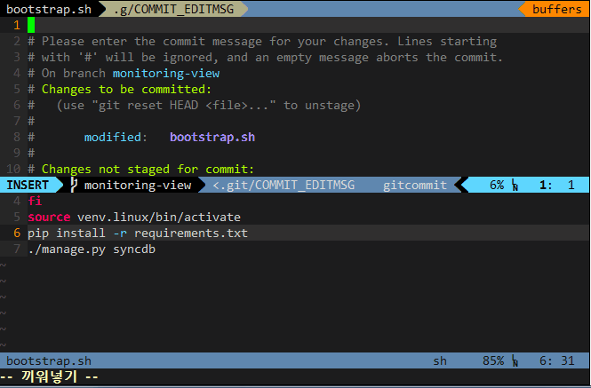

# vim-jira

`vim-jira` is a Vim plugin that queries JIRA issues and shows on AutoComplete list.

It will be helpful when you write commit messages on Vim. (e.g using [fugitive](https://github.com/tpope/vim-fugitive))

## Demo



## How to use

\<F5\> in insert mode.

## Installation

[Vundle](https://github.com/gmarik/Vundle.vim) is for you.

or,

```
cd ~/.vim/bundle
git clone git://github.com/mnpk/vim-jira.git
```

## Settings

in your .vimrc,

```
let g:jira_url = 'http://your.jira.url/here/'
let g:jira_username = 'your_jira_username'
```

##
